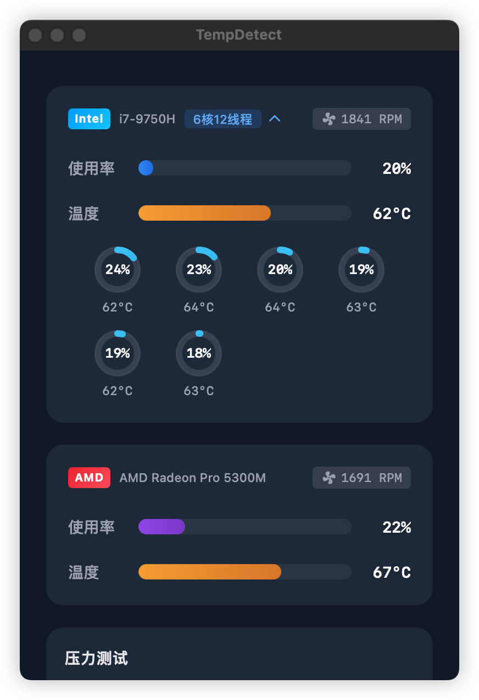

  
  <h1>TempDetect · 温度检测</h1>

  
A cross-platform computer thermal testing software based on Tauri 2.0

  
基于 Tauri 2.0 的跨平台桌面端散热测试软件

[English](#english) | [中文](#中文)

## English

### About
TempDetect is a lightweight desktop application that monitors your CPU and GPU temperatures, usage rates, and fan speeds in real-time. Built with Tauri, Vue 3, and Rust, it provides accurate hardware information with minimal resource usage.

The application uses Rust to interface directly with macOS system APIs (IOKit and SMC) for reading hardware sensors, while providing a smooth user experience through its Vue 3 frontend.

### Screenshots

&nbsp;&nbsp;&nbsp;&nbsp;&nbsp;&nbsp;

<em>Main Interface</em>&nbsp;&nbsp;&nbsp;&nbsp;&nbsp;&nbsp;&nbsp;&nbsp;&nbsp;&nbsp;&nbsp;&nbsp;&nbsp;&nbsp;&nbsp;&nbsp;&nbsp;&nbsp;&nbsp;&nbsp;&nbsp;&nbsp;&nbsp;&nbsp;<em>CPU Details</em>&nbsp;&nbsp;&nbsp;&nbsp;&nbsp;&nbsp;&nbsp;&nbsp;&nbsp;&nbsp;&nbsp;&nbsp;&nbsp;&nbsp;&nbsp;&nbsp;&nbsp;&nbsp;&nbsp;&nbsp;&nbsp;&nbsp;&nbsp;&nbsp;<em>Stress Test</em>

### Installation
Download the latest DMG file from the [Releases](https://github.com/c-zeong/tempdetect/releases) page.

### Roadmap
- [ ] Apple Silicon (M1/M2) support
- [ ] Windows support
- [ ] Linux support
- [ ] Multi-language support

### License
MIT License - see the [LICENSE](LICENSE) file for details

