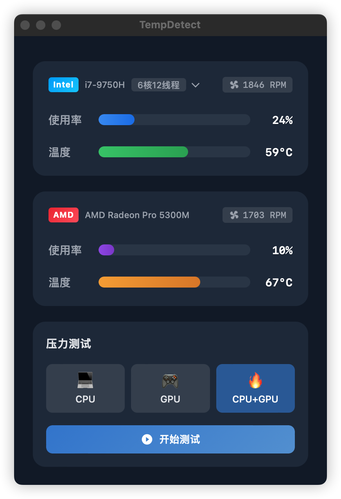
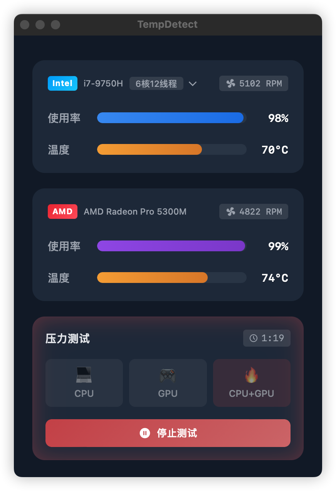

  
  <h1>TempDetect · 温度检测</h1>

  
A powerful desktop application for real-time CPU & GPU temperature monitoring

  
一款CPU & GPU 实时温度监控桌面应用

[English](#english) | [中文](#中文)

## English

### About
TempDetect is a lightweight desktop application that monitors your CPU and GPU temperatures, usage rates, and fan speeds in real-time. Built with Tauri, Vue 3, and Rust, it provides accurate hardware information with minimal resource usage.

The application uses Rust to interface directly with macOS system APIs (IOKit and SMC) for reading hardware sensors, while providing a smooth user experience through its Vue 3 frontend.

### Screenshots

&nbsp;&nbsp;&nbsp;&nbsp;&nbsp;&nbsp;

<em>Main Interface</em>&nbsp;&nbsp;&nbsp;&nbsp;&nbsp;&nbsp;&nbsp;&nbsp;&nbsp;&nbsp;&nbsp;&nbsp;&nbsp;&nbsp;&nbsp;&nbsp;&nbsp;&nbsp;&nbsp;&nbsp;&nbsp;&nbsp;&nbsp;&nbsp;<em>CPU Details</em>&nbsp;&nbsp;&nbsp;&nbsp;&nbsp;&nbsp;&nbsp;&nbsp;&nbsp;&nbsp;&nbsp;&nbsp;&nbsp;&nbsp;&nbsp;&nbsp;&nbsp;&nbsp;&nbsp;&nbsp;&nbsp;&nbsp;&nbsp;&nbsp;<em>Stress Test</em>

### Installation
Download the latest DMG file from the [Releases](https://github.com/yourusername/tempdetect/releases) page.

### Roadmap
- [ ] Apple Silicon (M1/M2) support
- [ ] Windows support
- [ ] Linux support
- [ ] Multi-language support

### License
MIT License - see the [LICENSE](LICENSE) file for details

---

## 中文

### 关于
TempDetect 是一款轻量级桌面应用，可实时监控 CPU 和 GPU 的温度、使用率和风扇转速。使用 Tauri、Vue 3 和 Rust 构建，以最小的资源消耗提供准确的硬件信息。

应用程序使用 Rust 直接与 macOS 系统 API（IOKit 和 SMC）交互来读取硬件传感器数据，同时通过 Vue 3 前端提供流畅的用户体验。

### 截图

&nbsp;&nbsp;&nbsp;&nbsp;&nbsp;&nbsp;

<em>主界面</em>&nbsp;&nbsp;&nbsp;&nbsp;&nbsp;&nbsp;&nbsp;&nbsp;&nbsp;&nbsp;&nbsp;&nbsp;&nbsp;&nbsp;&nbsp;&nbsp;&nbsp;&nbsp;&nbsp;&nbsp;&nbsp;&nbsp;&nbsp;&nbsp;<em>CPU 详情</em>&nbsp;&nbsp;&nbsp;&nbsp;&nbsp;&nbsp;&nbsp;&nbsp;&nbsp;&nbsp;&nbsp;&nbsp;&nbsp;&nbsp;&nbsp;&nbsp;&nbsp;&nbsp;&nbsp;&nbsp;&nbsp;&nbsp;&nbsp;&nbsp;<em>压力测试</em>

### 安装
从 [Releases](https://github.com/yourusername/tempdetect/releases) 页面下载最新的 DMG 文件。

### 开发计划
- [ ] 支持 Apple Silicon (M1/M2) 芯片
- [ ] 支持 Windows 系统
- [ ] 支持 Linux 系统
- [ ] 多语言支持

### 许可证
MIT 许可证 - 查看 [LICENSE](LICENSE) 文件了解详情
