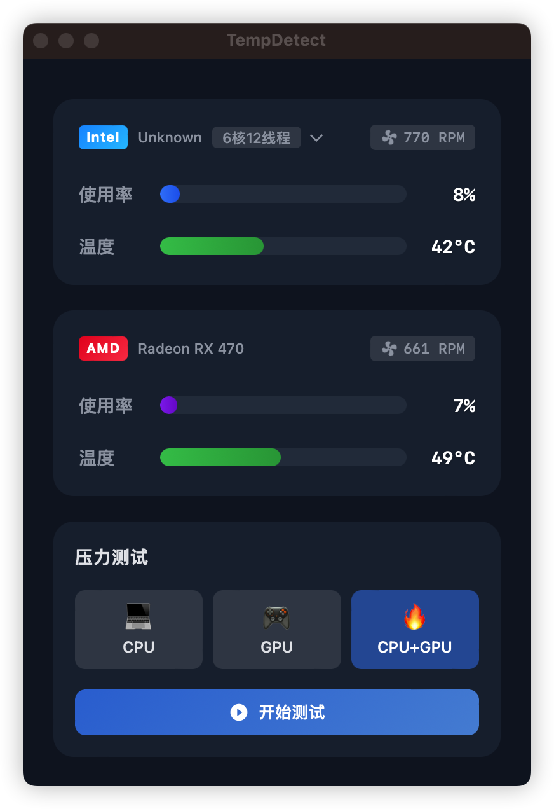
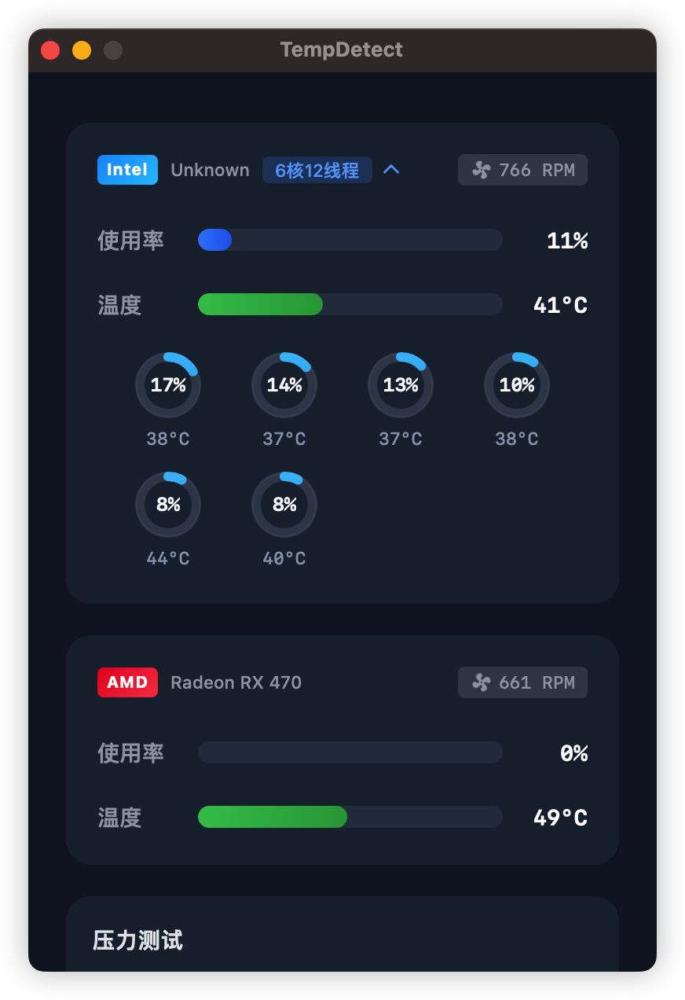
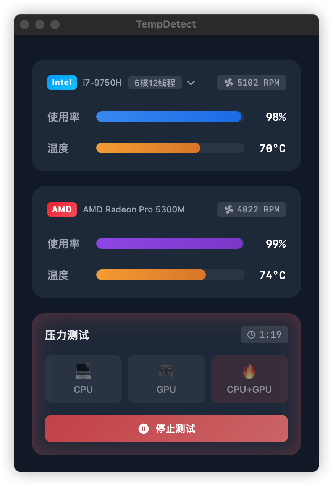

  
  <h1>TempDetect · 温度检测</h1>

  
基于 Tauri 2.0 的跨平台桌面端散热测试软件

[English](https://github.com/c-zeong/TempDetect) | [中文](https://github.com/c-zeong/TempDetect/blob/main/README.zh-CN.md)
### 关于
TempDetect 是一款轻量级桌面应用，可实时监控 CPU 和 GPU 的温度、使用率和风扇转速。使用 Tauri、Vue 3 和 Rust 构建，以最小的资源消耗提供准确的硬件信息。

应用程序使用 Rust 直接与 macOS 系统 API（IOKit 和 SMC）交互来读取硬件传感器数据，同时通过 Vue 3 前端提供流畅的用户体验。

### 截图

&nbsp;&nbsp;&nbsp;&nbsp;&nbsp;&nbsp;

<em>主界面</em>&nbsp;&nbsp;&nbsp;&nbsp;&nbsp;&nbsp;&nbsp;&nbsp;&nbsp;&nbsp;&nbsp;&nbsp;&nbsp;&nbsp;&nbsp;&nbsp;&nbsp;&nbsp;&nbsp;&nbsp;&nbsp;&nbsp;&nbsp;&nbsp;<em>CPU 详情</em>&nbsp;&nbsp;&nbsp;&nbsp;&nbsp;&nbsp;&nbsp;&nbsp;&nbsp;&nbsp;&nbsp;&nbsp;&nbsp;&nbsp;&nbsp;&nbsp;&nbsp;&nbsp;&nbsp;&nbsp;&nbsp;&nbsp;&nbsp;&nbsp;<em>压力测试</em>

### 安装
从 [Releases](https://github.com/c-zeong/tempdetect/releases) 页面下载最新的 DMG 文件。

### 开发计划
- [ ] 支持 Apple Silicon (M1/M2) 芯片
- [ ] 支持 Windows 系统
- [ ] 支持 Linux 系统
- [ ] 多语言支持

### 许可证
MIT 许可证 - 查看 [LICENSE](LICENSE) 文件了解详情